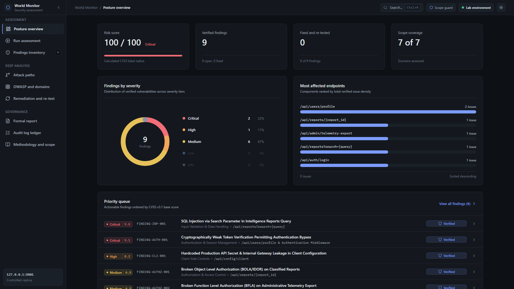
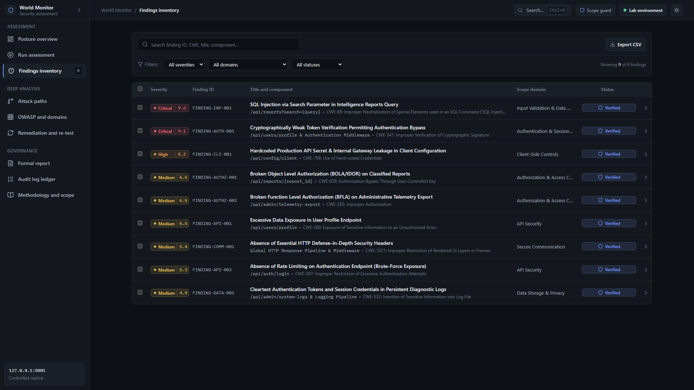
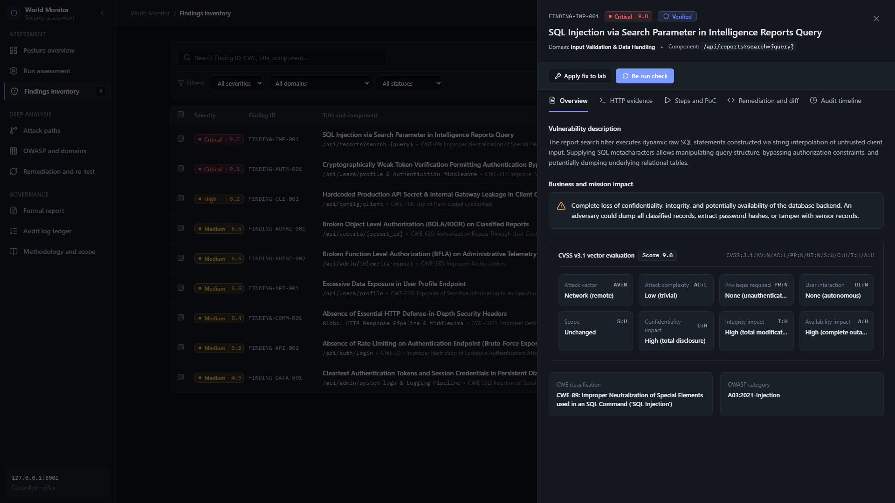
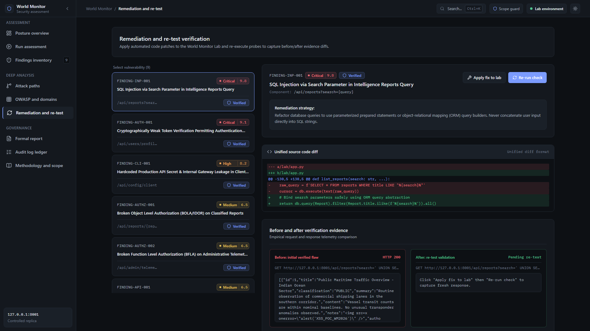
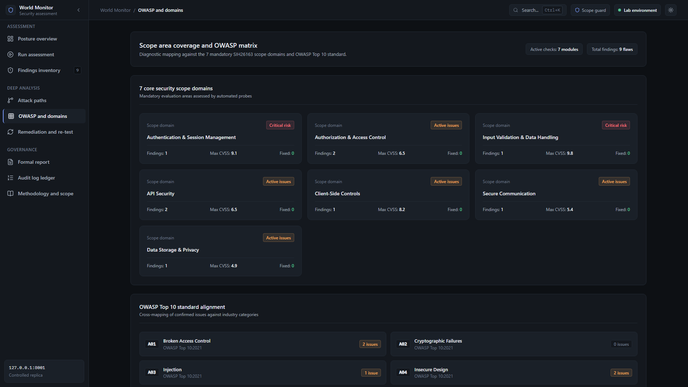
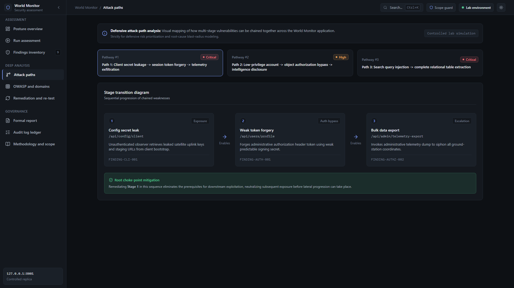

# World Monitor Security Assessment Platform

> **Smart India Hackathon 2026 · Problem Statement SIH26163 · NTRO**
>
> **Authorized defensive security assessment platform for controlled localhost evaluation.**

| Parameter | Specification |
|---|---|
| **Status** | Experimental academic prototype |
| **Scope** | Localhost / authorized targets only |
| **Target** | Synthetic World Monitor lab |
| **Frontend** | React + Vite |
| **Backend** | FastAPI |
| **Security Model** | Fail-closed Scope Guard |
| **Reporting** | Markdown + PDF |
| **Test Data** | Synthetic / fictional |

> ⚠️ **IMPORTANT — Read before using**
>
> This repository contains an **intentionally vulnerable synthetic lab target** (`lab/`).
> The lab is a local replica seeded with entirely fictional data. It deliberately
> exposes security weaknesses so that assessment modules can demonstrate detection
> and remediation workflows.
>
> **Do not connect this platform to a real World Monitor deployment, production
> database, or any system containing sensitive or classified information.**
> Authorized use only. Localhost scope is enforced by default and cannot be
> overridden at runtime.

---

## What This Demonstrates

This platform provides a complete defensive evaluation pipeline built specifically for controlled security assessments:

- **7 Core Security Diagnostic Modules**: Automated, non-destructive checks covering authentication, authorization, input validation, API security, client controls, transport security, and data storage.
- **Fail-Closed Localhost Scope Guard**: Architectural guardrail that drops outbound traffic targeting non-local hosts before packets leave the local interface.
- **Explicit Operator Authorization Gate**: Mandatory acknowledgement gate requiring operator verification before probe routines can execute.
- **FIRST-Compliant CVSS v3.1 Scoring**: Deterministic base score calculation reflecting attack vectors, complexity, privileges, and impact metrics.
- **Evidence-Backed Findings**: Every confirmed vulnerability is paired with raw HTTP request/response payloads, timing data, and status codes.
- **Cryptographic Audit-Chain Ledger**: SHA-256 hash-chained log recording every scan launch, diagnostic probe, and remediation action.
- **Remediation & Retest Verification**: Automated code patch injection into the synthetic lab coupled with instant before/after regression checks.
- **Source-Code Static Analysis Mode**: Static code scanning engine inspecting local source trees for hardcoded secrets, dangerous sinks, and API routes.
- **Formal Security Reporting**: On-demand compilation of executive summaries and technical finding dossiers in both Markdown and PDF formats.
- **Intentionally Vulnerable Synthetic Lab**: Sandboxed FastAPI mock application simulating complex intelligence platform workflows using synthetic records.

---

## Why This Project

Security assessments often suffer from fragmented workflows—probes are executed with generic scanners, results lack empirical verification, and remediation is detached from retesting.

This project demonstrates a unified, defensive engineering workflow:

1. **Controlled Target Environment**: Operates exclusively against an isolated synthetic replica or an explicitly authorized localhost target.
2. **Rigorous Scope Boundaries**: Hardcoded fail-closed validation guarantees diagnostic probes cannot inadvertently touch external networks.
3. **Multi-Domain Diagnostics**: In-depth coverage across OWASP Top 10 and CWE taxonomies tailored to API-driven applications.
4. **Empirical Evidence Capture**: Findings are proven with captured HTTP telemetry rather than hypothetical pattern flags.
5. **Standardized Severity Scoring**: Objective CVSS v3.1 metrics establish clear remediation priority.
6. **Closed-Loop Retest Verification**: Code-level patches are applied directly to the lab target and validated immediately with before/after diffs.
7. **Tamper-Evident Audit Trail**: Cryptographic ledger guarantees non-repudiation for audit and compliance inspection.
8. **Actionable Deliverables**: Generates formal documentation suitable for both software engineers and administrative stakeholders.

---

## Assessment Flow

```mermaid
flowchart LR
    A["Operator"] --> B["Authorization Gate"]
    B --> C["Scope Guard\n(Fail-Closed)"]
    C --> D["Diagnostic Modules\n(7 Core Domains)"]
    D --> E[("Synthetic Local Lab\n(Port 8001)")]
    E --> F["Captured Evidence\n(HTTP Telemetry)"]
    F --> G["Finding Catalog\n(CWE Mapping)"]
    G --> H["CVSS v3.1 Scoring\n(FIRST Standard)"]
    H --> I["Remediation Patch\n(Source Code Diff)"]
    I --> J["Retest Verification\n(Before / After Diff)"]
    J --> K["Formal Report\n(Markdown & PDF)"]
```



---

## Screenshots

The screenshots below reflect actual evaluation sessions conducted against the local synthetic lab target (`127.0.0.1:8001`).

### 1. Security Posture Overview

*Risk-prioritized assessment dashboard showing synthetic lab findings, severity breakdown, and scope coverage.*

---

### 2. Findings Inventory

*Catalog of identified vulnerabilities across the synthetic lab with CVSS v3.1 scores, CWE classifications, and components.*

---

### 3. Finding Detail & Evidence

*Deep-dive inspection drawer displaying CVSS vector metrics, mission impact analysis, and empirical HTTP evidence tabs.*

---

### 4. Remediation & Retest Verification

*Interactive patch application showing unified source diffs and before/after verification evidence against the lab target.*

---

### 5. Scope Coverage & OWASP Alignment

*Diagnostic mapping of all 7 evaluated security domains against OWASP Top 10 standards and active lab checks.*

---

### 6. Defensive Attack-Path Analysis

*Visual multi-stage chain analysis modeling chained vulnerability progression and root choke-point mitigations.*

---

## Assessment Modes

| Mode | Label | What it does |
|---|---|---|
| **LAB** | `LAB_SYNTHETIC` | Runs all 7 diagnostic modules against the bundled intentionally-vulnerable local lab target (`127.0.0.1:8001`). All findings originate from the synthetic replica. |
| **DYNAMIC_LOCAL** | `DYNAMIC_LOCAL` | Runs diagnostic HTTP probes against an authorized, self-hosted World Monitor instance on localhost (e.g., staging/dev). Requires explicit operator authorization before execution. |
| **SOURCE** | `SOURCE_STATIC` | Performs static source-code analysis on a local repository path. No outbound network probes are generated. |

---

## System Architecture


---

## Security Boundaries

The platform enforces rigid architectural controls to prevent accidental exposure or unauthorized usage:

1. **Localhost-Only by Default** — `engine/scope_guard.py` permits **localhost / 127.0.0.1 / ::1 only**. Any probe targeting a public IP address or external domain is rejected before the network socket is opened.
2. **Fail-Closed Architecture** — If destination resolution fails, encounters ambiguous hostnames, or points to unapproved targets, the Scope Guard terminates the request immediately.
3. **Mandatory Authorization Gate** — Operators must review and explicitly check the authorization acknowledgement in the console before probes can be dispatched.
4. **Intentionally Vulnerable Lab** — The `lab/` application is an isolated synthetic target featuring deliberate weaknesses for demonstration. It binds strictly to `127.0.0.1` and must never be exposed externally.
5. **Exclusively Synthetic Test Data** — All records in the lab database (usernames, tokens, coordinates, reports) are entirely fictional.
6. **No Production Credentials** — No real API keys, secrets, or production credentials exist in the codebase.
7. **No Classified Information** — No proprietary or classified intelligence data is included or processed.
8. **No Real World Monitor Deployment Included** — The platform contains diagnostic tooling and synthetic replica mocks; it does not contain or interface with production infrastructure.

---

## Project Structure

```
world-monitor-security/
├── api/                        # FastAPI assessment engine endpoints & SSE telemetry
│   ├── main.py                 # Core API routes, scan orchestrator, SSE streaming
│   └── __init__.py
├── engine/                     # Security diagnostic engine & Scope Guard
│   ├── modules/                # 7 core diagnostic probe modules
│   │   ├── api_security.py     # Excessive data exposure & rate limiting checks
│   │   ├── auth_session.py     # Token verification & session management checks
│   │   ├── authz_access.py     # BOLA/IDOR and BFLA authorization checks
│   │   ├── client_side.py      # Client configuration & secret leak checks
│   │   ├── data_storage.py     # Cleartext token & diagnostic log storage checks
│   │   ├── input_validation.py # SQL injection & input sanitization checks
│   │   └── secure_comm.py      # HTTP defense-in-depth header checks
│   ├── source_analysis/        # Static analysis scanners for source code mode
│   ├── cvss.py                 # FIRST-compliant CVSS v3.1 scoring calculator
│   ├── database.py             # SQLite persistence & audit log models
│   ├── runner.py               # Probe dispatch & execution engine
│   └── scope_guard.py          # Fail-closed localhost target validator
├── lab/                        # Intentionally vulnerable synthetic target (Port 8001)
│   ├── app.py                  # Vulnerable replica API endpoints
│   ├── database.py             # Lab database models
│   ├── seed.py                 # Synthetic database seeding script (fictional data)
│   └── vuln_config.py          # Dynamic vulnerability toggle & patch manager
├── dashboard/                  # Security Operator Console (Port 5173)
│   ├── src/                    # React + TypeScript source code
│   └── dist/                   # [Build output] Generated static assets (gitignored)
├── docs/                       # Documentation assets
│   └── screenshots/            # Verified application interface captures
├── reports/                    # Security report generation
│   └── generator.py            # Markdown & PDF report compiler
├── security_assessment/        # SIH26163 assessment documentation & test matrix
│   ├── README.md               # Assessment overview & quick navigation
│   ├── executive_summary.md    # Executive briefing
│   ├── final_report.md         # Comprehensive security assessment report
│   ├── sih_demo.md             # Live evaluation presentation script
│   └── threat_model.md         # STRIDE threat model & attack trees
├── tests/                      # Automated test suite (Scope Guard, CVSS, regression)
│   ├── test_cvss.py            # CVSS calculator unit tests
│   ├── test_regression.py      # Diagnostic probe regression tests
│   └── test_scope_guard.py     # Scope Guard boundary enforcement tests
├── .env.example                # Template configuration with safe placeholders
├── LICENSE                     # MIT License
├── README.md                   # Repository overview & operator guide
├── requirements.txt            # Python dependencies
├── run.bat                     # Windows startup script
├── run.sh                      # Linux / macOS startup script
├── SECURITY.md                 # Security policy, scope boundaries & disclosure
└── THIRD_PARTY_NOTICES.md      # Dependency licenses & referenced standards
```

> **Note on local and generated files:**
> - `assessment.db` — SQLite database generated locally at runtime (excluded from git)
> - `lab.db` — Synthetic lab SQLite database generated locally at runtime (excluded from git)
> - `reports/*.pdf` — Output reports compiled locally upon operator request (excluded from git)
> - `dashboard/dist/` — Production build assets output by Vite (excluded from git)
> - `dashboard/node_modules/` — Local frontend package dependencies (excluded from git)

---

## Quick Start

### Prerequisites

| Dependency | Minimum | Tested with |
|---|---|---|
| Python | 3.11+ | 3.11 / 3.12 / 3.13 |
| Node.js | 20 LTS | v24 LTS |

### 1. Install Python dependencies

```bash
pip install -r requirements.txt
```

### 2. Install frontend dependencies

```bash
cd dashboard && npm install
```

### 3. Configure environment

```bash
cp .env.example .env
# Edit .env — set a strong JWT_SECRET_KEY (min 32 random chars)
```

### 4. Launch all services

**Linux / macOS:**
```bash
chmod +x run.sh && ./run.sh
```

**Windows (Command Prompt / PowerShell):**
```powershell
.\run.bat
```

| Service | Address |
|---|---|
| World Monitor Lab (intentionally vulnerable synthetic target) | http://127.0.0.1:8001 |
| Assessment Engine API & Swagger UI | http://127.0.0.1:8000/docs |
| Security Operator Console | http://127.0.0.1:5173 |

---

## Three-Minute Evaluator Demo

A structured walkthrough demonstrating the full defensive assessment workflow:

### Minute 1 — Assess
1. Open the Security Operator Console at `http://127.0.0.1:5173`.
2. Navigate to **Run assessment** in the sidebar.
3. Verify target URL is set to `http://127.0.0.1:8001` (Synthetic Lab).
4. Check the **Authorization Acknowledgment** box to unlock the launch button.
5. Click **Launch Assessment**: watch the live diagnostic console stream non-destructive HTTP probes through all 7 modules with real-time status indicators.

### Minute 2 — Investigate
1. Navigate to **Findings inventory** to view the confirmed findings catalog.
2. Filter by `CRITICAL` or click `FINDING-INP-001` (SQL Injection) or `FINDING-AUTHZ-001` (BOLA/IDOR).
3. Review the complete CVSS v3.1 vector breakdown, affected endpoint, and CWE categorization.
4. Switch to the **HTTP evidence** tab to inspect the raw request and response data captured during execution.
5. Inspect the proposed remediation strategy and unified source code diff.

### Minute 3 — Remediate & Retest
1. Navigate to **Remediation & re-test**.
2. Select `FINDING-AUTHZ-001` from the vulnerability queue.
3. Click **Apply fix to lab** to inject the secure patch into the running lab application.
4. Click **Re-run check** to execute automated verification probes against the patched endpoint.
5. Observe the status transition to `RETESTED_PASS` with empirical before/after evidence showing the flaw resolved (`HTTP 403 Forbidden`).
6. Navigate to **Formal report** to export the final Markdown summary or generate a publication-quality PDF.

---

## Verification & Testing Status

- **Backend Test Suite**: Test suites covering Scope Guard boundary enforcement, CVSS v3.1 calculations, and diagnostic probe regression against the local lab are included under `tests/`.
  ```bash
  python -m pytest tests/ -v
  ```
  *(Note: Backend test suite execution requires Python 3.11+ installed on the host.)*

- **Frontend Validation**: Frontend TypeScript types, Oxlint rules, and Vite production builds are validated:
  ```bash
  cd dashboard
  npm run lint   # Oxlint static validation (0 errors)
  npm run build  # Clean production bundle compilation
  ```

---

## Pointing to a Self-Hosted World Monitor Instance

> ⚠️ Only point this platform at an instance you are **explicitly authorized** to assess.
> Never use real credentials, classified data, or production databases.

To assess an authorized self-hosted World Monitor instance on localhost:

1. Deploy the authorized target on a local port (e.g., `127.0.0.1:8080`).
2. Update `.env`: `WM_TARGET_URL=http://127.0.0.1:8080`
3. Select **DYNAMIC_LOCAL** mode in the operator console and complete the authorization gate.

---

## Documentation & Governance

- [Security Policy](SECURITY.md) — Scope boundary rules, responsible disclosure, and authorization requirements.
- [License](LICENSE) — Standard MIT open-source license.
- [Third-Party Notices](THIRD_PARTY_NOTICES.md) — Dependency licensing, standard attributions (FIRST, OWASP, CWE), and synthetic data notice.
- [Security Assessment Dossier](security_assessment/README.md) — Complete SIH26163 technical assessment reports, threat model, and test matrix.
- [Screenshot Gallery](docs/screenshots/) — Verified UI captures from the local synthetic assessment environment.

---

## Disclaimer

This software is developed exclusively for the Smart India Hackathon 2026 (SIH26163)
evaluation. It is an **experimental academic prototype**, not a production security tool.
All diagnostic techniques are non-destructive and strictly restricted to localhost
boundaries. Findings shown in any demo relate entirely to the **synthetic local lab
target** — they do not reflect the security posture of any real World Monitor deployment.
Do not use this platform to assess any system you are not explicitly authorized to test.
