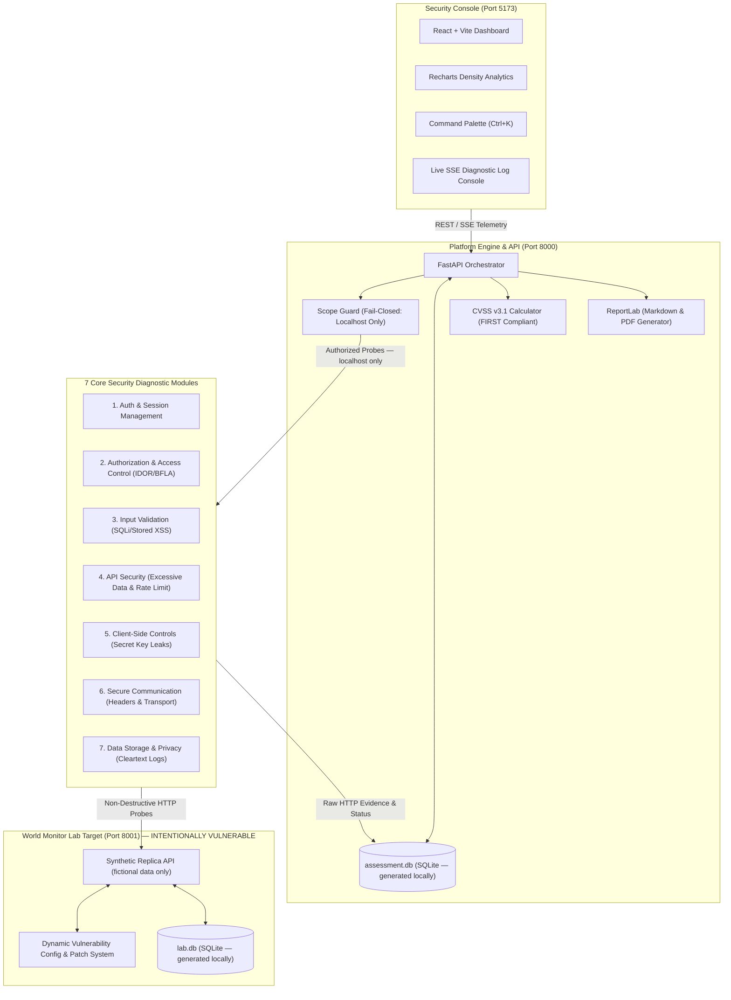

# World Monitor Security Assessment Platform

> **Smart India Hackathon 2026 · Problem Statement SIH26163 · NTRO**

**An authorized, defensive security-assessment platform** designed for controlled
localhost-based evaluation of the World Monitor application.

> ⚠️ **IMPORTANT — Read before using**
>
> This repository contains an **intentionally vulnerable synthetic lab target** (`lab/`).
> The lab is a local replica seeded with entirely fictional data. It deliberately
> exposes security weaknesses so that assessment modules can demonstrate detection
> and remediation workflows.
>
> **Do not connect this platform to a real World Monitor deployment, production
> database, or any system containing sensitive or classified information.**
> Authorized use only. Localhost scope is enforced by default and cannot be
> overridden at runtime.

---

## Assessment Modes

| Mode | Label | What it does |
|------|-------|--------------|
| **LAB** | `LAB_SYNTHETIC` | Runs all 7 diagnostic modules against the bundled intentionally-vulnerable local lab target (127.0.0.1:8001). All findings come from the synthetic replica. |
| **DYNAMIC_LOCAL** | `DYNAMIC_LOCAL` | Runs diagnostic HTTP probes against an authorized, self-hosted World Monitor instance on localhost (e.g. staging/dev). Requires explicit operator authorization before execution. |
| **SOURCE** | `SOURCE_STATIC` | Performs static source-code analysis on a local repository path. No outbound network probes. |

---

## System Architecture



---

## Security Boundaries

1. **Fail-Closed Scope Guard** — `engine/scope_guard.py` permits **localhost / 127.0.0.1 / ::1 only**. Any probe targeting a public IP or external domain is blocked before the request leaves the host.
2. **Mandatory Authorization Gate** — Operators must explicitly acknowledge authorization before any diagnostic probes are initiated.
3. **Audit Chain** — Every scan event, probe, and patch action is logged to an append-only SHA-256 hash-chained `audit_log` table.
4. **Intentionally Vulnerable Lab** — The `lab/` directory is a synthetic replica with deliberate weaknesses. It must only run on localhost and must never be exposed to any network.
5. **No production deployment included** — This repository does not include or reference any real World Monitor infrastructure, credentials, or data.

---

## Quick Start

### Prerequisites

| Dependency | Minimum | Tested with |
|------------|---------|-------------|
| Python | 3.11+ | 3.13 / 3.14 |
| Node.js | 20 LTS | v24 LTS |

### 1. Install Python dependencies

```bash
pip install -r requirements.txt
```

### 2. Install frontend dependencies

```bash
cd dashboard && npm install
```

### 3. Configure environment

```bash
cp .env.example .env
# Edit .env — set a strong JWT_SECRET_KEY (min 32 random chars)
```

### 4. Launch all services

**Linux / macOS:**
```bash
chmod +x run.sh && ./run.sh
```

**Windows (Command Prompt / PowerShell):**
```powershell
.\run.bat
```

| Service | URL |
|---------|-----|
| World Monitor Lab (intentionally vulnerable synthetic target) | http://127.0.0.1:8001 |
| Assessment API + Swagger UI | http://127.0.0.1:8000/docs |
| Security Operator Console | http://127.0.0.1:5173 |

---

## Running Tests

```bash
python -m pytest tests/ -v
```

Tests cover: Scope Guard fail-closed enforcement, CVSS v3.1 calculations, and regression probes against the local lab.

---

## Three-Minute Evaluator Demo

### Minute 1 — Posture Overview & Live Assessment
1. Open http://127.0.0.1:5173.
2. Navigate to **Run Assessment** in the left sidebar.
3. Check the **Authorization Acknowledgment** box — this enables the launch button.
4. Click **Launch Assessment**: the real-time SSE console streams probe execution through all 7 modules, surfacing findings with live timing and status badges.

### Minute 2 — Finding Inspection & Evidence
1. Navigate to **Findings Inventory**.
2. Filter by `CRITICAL` or click `FINDING-INP-001` (SQL Injection) or `FINDING-AUTHZ-001` (BOLA/IDOR).
3. Inspect CVSS v3.1 vector breakdown, raw HTTP evidence captured from the lab probe, steps to reproduce, and the proposed remediation diff.

### Minute 3 — Remediation & Retest
1. Navigate to **Remediation & Retest**.
2. Select `FINDING-AUTHZ-001`, click **Apply Fix to Lab**, then **Re-run Verification Check**.
3. Status transitions to `RETESTED_PASS` with before/after evidence confirming `HTTP 403 Forbidden`.
4. Navigate to **Formal Report** to download the Markdown or PDF report.

---

## Pointing to a Self-Hosted World Monitor Instance

> ⚠️ Only point this platform at an instance you are **explicitly authorized** to assess.
> Never use real credentials, classified data, or production databases.

To assess an authorized self-hosted World Monitor instance on localhost:

1. Deploy the target on a local port (e.g. `127.0.0.1:8080`).
2. Update `.env`: `WM_TARGET_URL=http://127.0.0.1:8080`
3. Select **DYNAMIC_LOCAL** mode in the operator console and follow the authorization gate.

---

## Disclaimer

This software is developed exclusively for the Smart India Hackathon 2026 (SIH26163)
evaluation. It is an **experimental academic prototype**, not a production security tool.
All diagnostic techniques are non-destructive and strictly restricted to localhost
boundaries. Findings shown in any demo relate entirely to the **synthetic local lab
target** — they do not reflect the security posture of any real World Monitor deployment.
Do not use this platform to assess any system you are not explicitly authorized to test.
